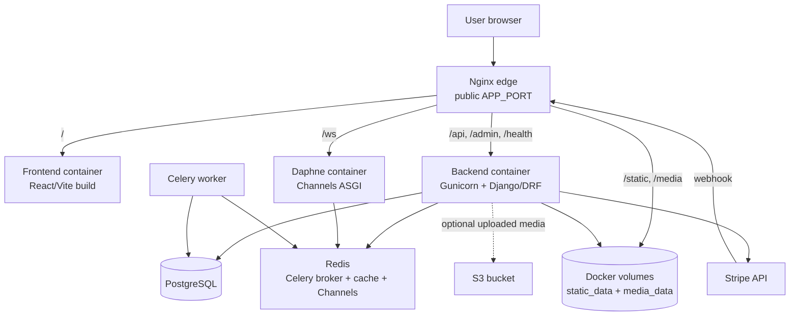

<div align="center">

<h1>🚀 Best-CRM Open-source</h1>

<strong>Production-proven full-stack CRM with Django, React, PostgreSQL, Redis, Celery, Stripe, Docker, and tenant-based access control.</strong>
</div>

## Overview

Best-CRM started as a real internal CRM for the digital agency **[EC-VEECE](https://www.linkedin.com/company/ec-veece/)**. It automated project management, finance tracking, reporting, and team collaboration, and ran 24/7 in production for 1+ years.

Production impact:

- Managed **100+ projects** and **10+ employees**
- Reduced administrative workload by **30%**
- Reduced order processing time by **over 2×**

This open-source version keeps the core production architecture: Django/DRF, React, PostgreSQL, Redis, Celery, Stripe, optional S3 media storage, Nginx, Docker, role-based access, and company-level data isolation.

## Features

- **Production-proven CRM workflows**: projects, teams, clients, worklogs, finance, notifications, reviews, and internal collaboration in one system.
- **Company-level tenant isolation**: managers, workers, and clients only see the data they are allowed to access.
- **Real role-based operations**: managers control teams, projects, payments, salaries, and reports; workers track assigned work; clients follow project progress and payments.
- **Finance engine**: payments, salaries, transactions, Stripe checkout/webhooks, and currency-aware company summaries.
- **Operational project management**: assigned teams, statuses, budgets, deadlines, PDF blueprints, chat messages, worklogs, and client reviews.
- **Production-style infrastructure**: React frontend, Django/DRF API, PostgreSQL, Redis, Celery, Channels, Nginx, Docker, CI, healthchecks, and environment-specific settings.
- **Flexible media storage**: local Docker media volume for portfolio/demo runs or S3-backed uploads for production deployments.

## System Architecture



## Tech Stack

- **Backend**: Python 3.12, Django 5.1, Django REST Framework, Simple JWT, django-cors-headers.
- **WebSocket backend and background jobs**: Django Channels, Daphne, Celery, Redis, django-redis.
- **Frontend**: React 18, TypeScript, Vite, React Router, Tailwind CSS, lucide-react.
- **Data and storage**: PostgreSQL, Redis, local Docker media volumes, optional S3 via django-storages and boto3.
- **Infrastructure**: Docker Compose, multi-stage Dockerfiles, Nginx edge proxy, Gunicorn, healthchecks, environment-specific settings.
- **Payments and documents**: Stripe API, Stripe webhooks, ReportLab, WeasyPrint.
- **Testing and CI**: pytest, pytest-django, pytest-asyncio, Vitest, Testing Library, Playwright, GitHub Actions.

## Documentation

- [System overview](docs/system-overview.md)
- [API overview](docs/api-overview.md)

## Prerequisites

- Docker Desktop with Docker Compose.
- Git.
- Node.js is only needed if you run frontend commands directly outside Docker.

## Quick Start: Production-like Local Stack

This runs the built frontend and backend behind one Nginx entrypoint.

```bash
git clone https://github.com/Yurii-Slyvinskyi/Best-CRM-Open-Source.git
cd Best-CRM-Open-Source
cp .env.prod.example .env
```

For a local demo without S3, set this in `.env` before starting:

```env
USE_S3_STORAGE=False
```

Then start the stack:

```bash
docker compose -f docker-compose.prod.yml up --build -d
```

Open:

- App: http://localhost:8080
- Health check: http://localhost:8080/health/
- API base path: http://localhost:8080/api/

Seed demo data:

```bash
docker compose -f docker-compose.prod.yml exec backend python manage.py seed_demo_data
```

## Demo Accounts

All seeded users use this password:

```text
DemoPass_123!
```

Main company:

- `demo_manager`
- `demo_worker`
- `demo_worker_2`
- `demo_client`
- `demo_client_2`

Isolation company:

- `other_manager`
- `other_worker`
- `other_client`

Stop the stack:

```bash
docker compose -f docker-compose.prod.yml down
```

## Development

Create a development `.env`:

```bash
cp .env.example .env
```

Start the development stack:

```bash
docker compose -f docker-compose.dev.yml up --build
```

Development URLs:

- Frontend: http://localhost:3000
- Backend API: http://localhost:8000/api/
- Backend health: http://localhost:8000/health/
- Daphne/WebSocket service: ws://localhost:8001

Seed demo data:

```bash
docker compose -f docker-compose.dev.yml exec backend python manage.py seed_demo_data
```

## Tests and Checks

Backend tests:

```bash
docker compose -f docker-compose.dev.yml -f docker-compose.test.yml run --rm backend-tests
```

Frontend tests:

```bash
cd frontend
npm test
```

Frontend production build:

```bash
cd frontend
npm run build
```

Compose validation:

```bash
docker compose -f docker-compose.dev.yml config --quiet
docker compose -f docker-compose.prod.yml config --quiet
```

Whitespace check:

```bash
git diff --check
```

## Environment Files

- `.env.example`: development and local demo values.
- `.env.prod.example`: production-like Docker values.

Production settings require explicit values for critical secrets and storage mode. Use `USE_S3_STORAGE=False` for Docker volume media storage, or `USE_S3_STORAGE=True` with valid AWS/S3 settings.

## Repository Hygiene

Uploaded media, collected static files, logs, caches, local databases, build outputs, and local environment files should not be committed.

## Contact

- Email: [yura.programing@gmail.com](mailto:yura.programing@gmail.com)
- LinkedIn: [Yurii Slyvinskyi](https://www.linkedin.com/in/yurii-slyvinskyi-827831284)
